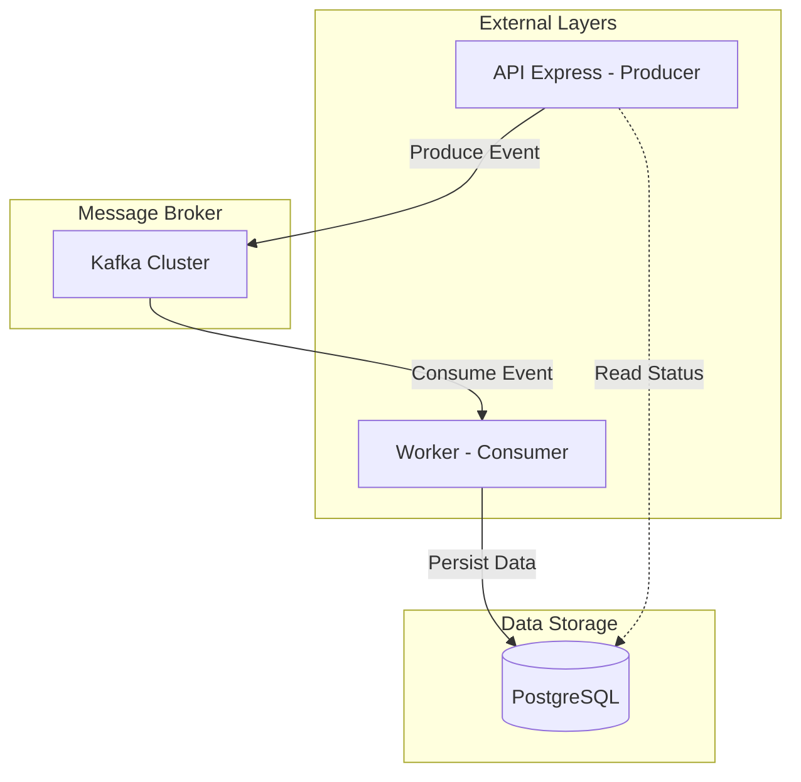

# Centralizador PoC 🚀


Este projeto é uma **Prova de Conceito (PoC)** focada na construção de um ecossistema distribuído para centralização de eventos. Utiliza uma arquitetura baseada em eventos (Event-Driven) para garantir escalabilidade, resiliência e desacoplamento entre produtores e consumidores.

---

## ⚡ Quick Start

Para rodar o projeto localmente com toda a infraestrutura necessária (Kafka, Postgres, UI), execute:

```bash
# Clone o repositório
git clone https://github.com/Guilherme-Ramos-Nepomuceno/centralizador-poc.git
cd centralizador-poc

# Inicie a infraestrutura via Docker
docker-compose up -d

# Instale as dependências
npm install

# Rode em modo desenvolvimento
npm run dev
```

---

## 🏗️ Architecture Graph

A aplicação segue os princípios da **Clean Architecture**, dividindo responsabilidades entre transporte de dados, regras de negócio e infraestrutura externa.



---

## 🌐 Environment Variables

| Key | Description | Required | Default |
| :--- | :--- | :---: | :--- |
| `KAFKA_BROKERS` | Lista de brokers do Kafka (comma-separated) | Y | `localhost:9094` |
| `DATABASE_URL` | String de conexão com o PostgreSQL | Y | `postgres://...` |
| `PORT` | Porta de execução da API Express | N | `3000` |

---

## 📂 Index de Funcionalidades

Abaixo estão os links para o detalhamento técnico de cada módulo do sistema:

- [**📦 Core & Business Logic**](./src/data/README.md): Regras de negócio e casos de uso.
- [**🌐 Express Framework**](./src/framework/express/README.md): Implementação do servidor HTTP e rotas.
- [**🛠️ Infrastructure**](./src/infra/README.md): Configurações de Banco de Dados e Kafka.

---

> [!IMPORTANT]
> Por ser uma **Prova de Conceito**, as credenciais no `docker-compose.yml` são padronizadas para facilitar o teste inicial. Não utilize estas configurações em ambiente de produção sem a devida parametrização via secrets.
